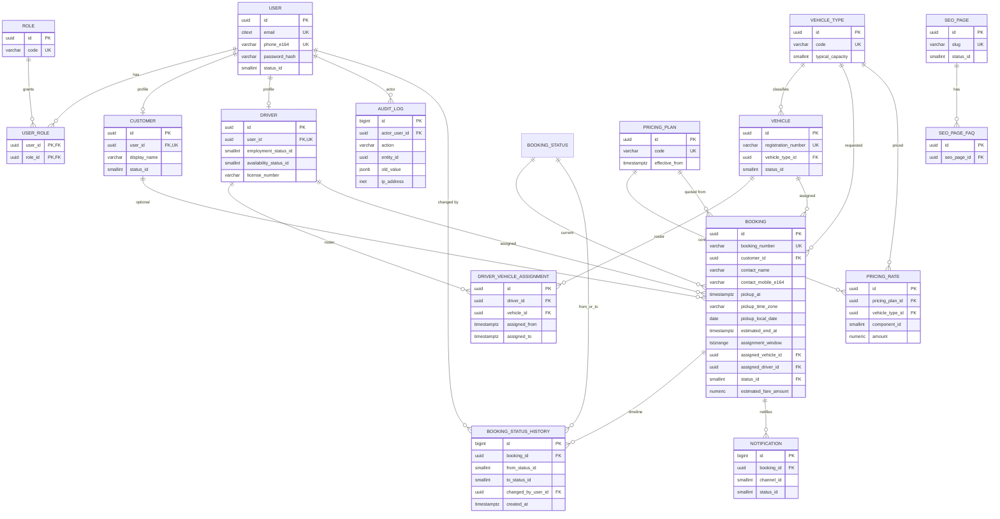

# Database design

**Status:** Approved and implemented in Phase 1 (schema, EF Core, first migration). No booking/auth APIs.

**Engine:** PostgreSQL 16+. Access via EF Core from the modular monolith. See [ADR-003](../decisions/ADR-003-postgresql.md).

**Payment:** Out of V1. No payment, refund, invoice, or coupon tables. See [ADR-004](../decisions/ADR-004-no-payment-v1.md).

Local runbook: [local-setup.md](local-setup.md).

---

## 1. Domain overview

The database supports advance taxi booking for a Bangalore fleet (~20 vehicles today, designed to grow toward 2,000+ vehicles, more customers, and eventually more cities).

One PostgreSQL database. One ASP.NET Core API. Referential integrity in the database. Business rules in application services. No sharding, no second database, no event store, no CQRS read models.

| Domain | Responsibility |
| --- | --- |
| Identity | Users, roles, credentials foundation |
| Customers | Booking customers (profile + status) |
| Drivers | Fleet drivers, license reference, availability |
| Vehicles | Fleet vehicles, types, current and historical driver assignment |
| Bookings | Trip requests, assignment, status history, overlap windows |
| Pricing | Versioned fare rules by vehicle type and trip category |
| Notifications | Delivery tracking for WhatsApp / SMS / email (later) |
| SEO | CMS-backed landing pages and FAQ items |
| Audit | Administrative and sensitive business-change log |

Operational flow the schema must support later:

```text
Customer requests trip
  → Booking (Pending) + fare snapshot
  → Admin accept / reject
  → Admin assigns driver + vehicle (no overlap)
  → Confirmed → notify customer
  → later operational statuses (en route, picked up, completed / cancelled)
```

---

## 2. Design principles

| Topic | Decision |
| --- | --- |
| Primary keys | Domain entities: UUID (`uuid`). High-volume append-only tables: `bigint` identity. See [§16](#16-primary-keys). |
| Public identifiers | Bookings also have a unique human-readable `booking_number`. API URLs use UUID, not sequential integers. |
| Foreign keys | Declared FKs for all relationships. Restrict or restrict+set null as specified per table. |
| Indexes | Only for documented query patterns. Partial indexes where status filters are selective. |
| Unique constraints | Natural keys: phone, email (when present), vehicle registration, role name, SEO slug, booking number. |
| Timestamps | `timestamptz` stored in UTC. Display in IST in the UI. `created_at` / `updated_at` on mutable entities. |
| Status values | Lookup tables with a stable `code` (not free-text columns, not PostgreSQL `ENUM` types). |
| Soft deletion | Status flags (`active` / `inactive`) for people and vehicles. Bookings are never deleted. No blanket `is_deleted`. |
| Concurrency | `xmin` mapped as EF concurrency token on `booking`. Vehicle **and** driver overlap via exclusion constraints + transaction. |
| Secrets | Password hashes only on `user`. Never audit or log passwords, OTPs, or tokens. |

---

## 3. Entity list

### Implemented in this design (logical model)

| Entity | Table | PK type |
| --- | --- | --- |
| Role | `role` | uuid |
| User | `user` | uuid |
| UserRole | `user_role` | composite (`user_id`, `role_id`) |
| Customer | `customer` | uuid |
| Driver | `driver` | uuid |
| VehicleType | `vehicle_type` | uuid |
| Vehicle | `vehicle` | uuid |
| DriverVehicleAssignment | `driver_vehicle_assignment` | uuid |
| Booking | `booking` | uuid |
| BookingStatus | `booking_status` | smallint (`id`) |
| BookingStatusHistory | `booking_status_history` | bigint |
| PricingPlan | `pricing_plan` | uuid |
| PricingRate | `pricing_rate` | uuid |
| Notification | `notification` | bigint |
| SeoPage | `seo_page` | uuid |
| SeoPageFaq | `seo_page_faq` | uuid |
| AuditLog | `audit_log` | bigint |
| OperationalSetting | `operational_setting` | varchar key |
| BookingNumberSequence | `booking_number_sequence` | int year |

Lookup / reference rows (small, seeded):

| Entity | Table |
| --- | --- |
| UserStatus | `user_status` |
| CustomerStatus | `customer_status` |
| DriverEmploymentStatus | `driver_employment_status` |
| DriverAvailabilityStatus | `driver_availability_status` |
| VehicleStatus | `vehicle_status` |
| TripType | `trip_type` |
| JourneyType | `journey_type` |
| PricingComponent | `pricing_component` |
| NotificationType | `notification_type` |
| NotificationChannel | `notification_channel` |
| NotificationStatus | `notification_status` |
| SeoPageStatus | `seo_page_status` |

### Explicitly not in this design

- `payment`, `payment_transaction`, `refund`, `invoice`, `coupon`
- `city`, `service_area` (deferred — [§18](#18-multi-city-future))
- `review` (separate domain later; not part of the booking transaction)
- `admin_user` as a separate identity store (admin is a **role** on `users`)
- PostgreSQL partitioning, Citus, or additional databases

---

## 4. Identity

### 4.1 Role

Flexible role model so later roles (for example Dispatcher) do not require a schema rewrite.

| Column | Type | Required | Notes |
| --- | --- | --- | --- |
| id | uuid | yes | PK |
| code | varchar(32) | yes | Unique. `customer`, `admin`, `driver` |
| name | varchar(64) | yes | Display name |
| created_at | timestamptz | yes | UTC |

Seed: `customer`, `admin`, `driver`.

### 4.2 User

Single identity table for everyone who can authenticate. Profiles (`customer`, `driver`) hang off this row. Admins may have no customer/driver profile.

| Column | Type | Required | Notes |
| --- | --- | --- | --- |
| id | uuid | yes | PK |
| email | citext | no | Unique when not null. Lowercased via `citext`. |
| phone_e164 | varchar(16) | no | Unique when not null. E.164 (e.g. `+9198…`). |
| password_hash | varchar(256) | no | Null until auth is implemented / password set. Never log. |
| status_id | smallint | yes | FK `user_status`. Default active. |
| email_confirmed_at | timestamptz | no | |
| phone_confirmed_at | timestamptz | no | |
| created_at | timestamptz | yes | |
| updated_at | timestamptz | yes | |

**Constraints**

- At least one of `email` or `phone_e164` must be present (`CHECK`).
- Unique indexes on `email` and `phone_e164` where not null.
- `phone_e164` is null or E.164 (`^\+[1-9][0-9]{7,14}$`).

**Not stored:** Aadhaar, PAN, date of birth, full address on the user, government ID scans.

**Phase 5:** public authentication is phone + OTP. `password_hash` stays nullable and unused (reserved for a possible later staff-password phase). OTP plaintext is never stored.

### 4.2a OtpChallenge

| Column | Type | Notes |
| --- | --- | --- |
| id | uuid | PK |
| phone_e164 | varchar(16) | Normalized destination |
| code_hash | varchar(64) | HMAC-SHA256 hex |
| salt | varchar(32) | Per-challenge |
| expires_at | timestamptz | |
| attempt_count | smallint | |
| consumed_at | timestamptz | Set on success, replace, or lock |
| created_at | timestamptz | |
| request_ip | varchar(64) | |

### 4.2b RefreshSession

| Column | Type | Notes |
| --- | --- | --- |
| id | uuid | PK |
| user_id | uuid | FK `users` |
| token_hash | varchar(64) | SHA-256 of refresh token, unique |
| expires_at | timestamptz | |
| created_at | timestamptz | |
| revoked_at | timestamptz | Logout, rotation, replay |
| replaced_by_id | uuid | Next session after rotation |
| request_ip | varchar(64) | |
| user_agent | varchar(256) | |

Migration: `PhoneOtpAuthentication`.

**Approved:** one identity table (`users`) with roles. There is no separate admin identity store. The future authorization layer (not Phase 1) must ensure customer-role sessions cannot call admin endpoints. A staff member who also books can hold both `admin` and `customer` roles.

### 4.3 UserRole

| Column | Type | Required | Notes |
| --- | --- | --- | --- |
| user_id | uuid | yes | FK `users`, PK part |
| role_id | uuid | yes | FK `role`, PK part |
| assigned_at | timestamptz | yes | |
| assigned_by_user_id | uuid | no | FK `user`. Null if seeded/system. |

### 4.4 UserStatus (lookup)

`active`, `disabled`, `locked`. Disabled is the deactivation path (no `is_deleted` on `user`).

---

## 5. Customer

One customer profile per user who books. 1:1 with `user`.

| Column | Type | Required | Notes |
| --- | --- | --- | --- |
| id | uuid | yes | PK |
| user_id | uuid | yes | FK `user`, **unique** |
| display_name | varchar(120) | yes | |
| status_id | smallint | yes | FK `customer_status`: `active`, `inactive` |
| created_at | timestamptz | yes | |
| updated_at | timestamptz | yes | |

Phone and email live on `user` so uniqueness and login stay in one place. Customer search uses a join (or a later generated column) on `user.phone_e164` / `user.email`.

**Indexes**

- Unique `user_id`
- `status_id` (low selectivity; optional — skip unless admin filters by status at scale)
- Search: unique indexes already on `user.phone_e164` and `user.email`

**Soft deactivation:** `customer_status = inactive`. Historical bookings remain. The user can also be `disabled`.

**Not stored:** payment methods, government IDs, home address as a separate PII dump. Trip addresses live on `booking`.

Registered customers exist for login and booking history. **Guest bookings do not require a `customer` or `user` row.** Contact details for every booking (guest or registered) are stored as a snapshot on `booking` (see [§8.2](#82-booking-columns)). When a registered customer books, `customer_id` is set and the snapshot is copied at request time so later profile edits do not rewrite history.

---

## 6. Driver

### 6.1 Status model (two axes)

A single enum mixing `Available`, `Unavailable`, `Active`, and `Inactive` conflates employment with dispatch state.

| Axis | Values | Meaning |
| --- | --- | --- |
| Employment | `active`, `inactive`, `suspended` | Can this person be assigned at all? Inactive = left the fleet. Suspended = temporarily barred. |
| Availability | `available`, `unavailable`, `on_trip`, `off_duty` | Operational state. Independent of employment. |

Examples: Active + Unavailable (desk should not assign); Active + OnTrip (already occupying a window).

Assignment rules (application, later):

- Employment not `active` → cannot assign.
- Availability `unavailable` or `off_duty` → cannot assign to new trips.
- Availability `on_trip` → occupied by the current assignment window; overlap constraints still apply.
- Active + available → eligible.

### 6.2 Driver columns

| Column | Type | Required | Notes |
| --- | --- | --- | --- |
| id | uuid | yes | PK |
| user_id | uuid | yes | FK `user`, **unique** |
| display_name | varchar(120) | yes | |
| employment_status_id | smallint | yes | FK |
| availability_status_id | smallint | yes | FK |
| license_number | varchar(32) | no | Operational reference. Unique when not null. Not a scanned document. |
| license_expires_on | date | no | Date only (IST calendar date as `date`). |
| created_at | timestamptz | yes | |
| updated_at | timestamptz | yes | |

**Not stored:** Aadhaar, bank account, live GPS track, password (that is on `user`).

Mobile is on `user.phone_e164`.

**Indexes:** unique `user_id`; unique `license_number` where not null; `(employment_status_id, availability_status_id)` for dispatch lists.

---

## 7. Vehicle

### 7.1 VehicleType (not hardcoded in application code)

Vehicle classes are rows, not C# enums baked into business logic as the only source of truth. The API may still have constants for *seeded* codes (`sedan`, `suv`, `innova`, `premium`) but new types are added as data.

| Column | Type | Required | Notes |
| --- | --- | --- | --- |
| id | uuid | yes | PK |
| code | varchar(32) | yes | Unique, stable (`sedan`, `suv`, `innova`, `premium`) |
| name | varchar(64) | yes | Display |
| typical_capacity | smallint | yes | Default passenger capacity |
| sort_order | int | yes | Admin/UI ordering |
| is_active | boolean | yes | Hide from new bookings without deleting |
| created_at | timestamptz | yes | |
| updated_at | timestamptz | yes | |

### 7.2 Vehicle

| Column | Type | Required | Notes |
| --- | --- | --- | --- |
| id | uuid | yes | PK |
| registration_number | varchar(16) | yes | Unique. Normalized: uppercase, no spaces (`KA01AB1234`). |
| vehicle_type_id | uuid | yes | FK `vehicle_type` |
| capacity | smallint | yes | May differ from type default |
| status_id | smallint | yes | FK: `active`, `inactive`, `maintenance` |
| created_at | timestamptz | yes | |
| updated_at | timestamptz | yes | |

No `is_available` boolean. Availability for **trips** is derived from booking assignment windows plus `status_id`. A car in `maintenance` must not be assigned (application + optional check).

### 7.3 Driver–vehicle relationship

**Choice: historical assignment table, not only a current FK.**

Fleet operations need “who had this car last month?” and “what is assigned today?”. A single `vehicle.current_driver_id` loses history and makes overlap of *default* cars harder to audit.

`driver_vehicle_assignment`:

| Column | Type | Required | Notes |
| --- | --- | --- | --- |
| id | uuid | yes | PK |
| driver_id | uuid | yes | FK `driver` |
| vehicle_id | uuid | yes | FK `vehicle` |
| assigned_from | timestamptz | yes | |
| assigned_to | timestamptz | no | Null = current assignment |
| assigned_by_user_id | uuid | no | FK `user` (admin) |
| created_at | timestamptz | yes | |

**Constraints**

- `CHECK (assigned_to IS NULL OR assigned_to > assigned_from)`
- Partial unique: **one current vehicle per driver** — unique `(driver_id)` where `assigned_to IS NULL`
- Partial unique: **one current driver per vehicle** — unique `(vehicle_id)` where `assigned_to IS NULL`

This is the **default / roster** link (which car a driver usually takes). It does **not** replace booking-level assignment. A booking still points at the vehicle used for that trip. Overlap protection is on **booking time windows**, not on this roster table.

If a driver is temporarily given another car for one trip, that is the booking assignment; the roster row can stay unchanged.

---

## 8. Booking

### 8.1 Trip classification (for pricing, not extra product scope)

| Lookup | Codes (initial) |
| --- | --- |
| `trip_type` | `airport`, `local`, `outstation`, `corporate` |
| `journey_type` | `one_way`, `round_trip` |

These are stored on the booking so a later pricing engine can select rates without parsing notes. Values are data, not hardcoded fares.

### 8.2 Booking columns

| Column | Type | Required | Notes |
| --- | --- | --- | --- |
| id | uuid | yes | PK. Public API id. |
| booking_number | varchar(24) | yes | Unique public id. See [§8.5](#85-public-booking-number). Never expose the UUID as the customer-facing number. |
| customer_id | uuid | no | FK `customer`. Null for guest bookings. |
| contact_name | varchar(120) | yes | Snapshot. Guest or registered. |
| contact_mobile_e164 | varchar(16) | yes | Snapshot. Required for guests and registered. |
| contact_email | citext | no | Snapshot. Optional. |
| pickup_address | varchar(500) | yes | |
| pickup_latitude | numeric(9,6) | no | Nullable until Maps. Pair with longitude. |
| pickup_longitude | numeric(9,6) | no | |
| drop_address | varchar(500) | no | Typical for V1 trips; not forced at DB level. |
| drop_latitude | numeric(9,6) | no | Nullable until Maps. Pair with longitude. |
| drop_longitude | numeric(9,6) | no | |
| pickup_at | timestamptz | yes | Instant of pickup, stored UTC. |
| pickup_time_zone | varchar(64) | yes | IANA id, default `Asia/Kolkata`. Future cities keep this per booking. |
| pickup_local_date | date | yes | Calendar date in `pickup_time_zone` (booking date for ops queues). |
| estimated_end_at | timestamptz | no | Required **when** a vehicle/driver is assigned. |
| estimated_distance_km | numeric(8,2) | no | Snapshot at quote/request. |
| estimated_fare_amount | numeric(12,2) | no | `numeric`, not float. Quote snapshot, not a charge. |
| currency_code | char(3) | no | `INR` when fare is set. Explicit so more currencies can be added. |
| requested_vehicle_type_id | uuid | yes | FK `vehicle_type`. |
| trip_type_id | smallint | yes | FK |
| journey_type_id | smallint | yes | FK |
| assigned_driver_id | uuid | no | FK `driver` at assignment time |
| assigned_driver_display_name | varchar(120) | no | Snapshot; required by CHECK when driver assigned |
| assigned_driver_phone_e164 | varchar(16) | no | Snapshot |
| assigned_vehicle_id | uuid | no | FK `vehicle` at assignment time |
| assigned_vehicle_registration | varchar(16) | no | Snapshot |
| assigned_vehicle_type_code | varchar(32) | no | Snapshot |
| assigned_vehicle_type_name | varchar(64) | no | Snapshot |
| assignment_window | tstzrange | no | `[pickup_at - buffer, estimated_end_at + buffer)`; set on assign. |
| status_id | smallint | yes | FK `booking_status`. Default pending. |
| customer_notes | varchar(1000) | no | Bounded length. |
| pricing_plan_id | uuid | no | FK `pricing_plan`. Quote plan snapshot. |
| created_at | timestamptz | yes | System clock UTC |
| updated_at | timestamptz | yes | System clock UTC |

**Historical snapshots:** Do not report past trips solely from current `driver` / `vehicle` / `pricing_rate` rows. Assignment and fare fields on the booking are copied at quote/assign time so later fleet or tariff edits leave history correct.

**Derived data:** Do not store “is upcoming”, “duration hours”, or live fare totals as extra columns. Duration = `estimated_end_at - pickup_at` when both exist.

**xmin:** Map PostgreSQL `xmin` as an EF Core concurrency token so two admins cannot silently overwrite accept/reject/assign.

**Checks**

- Pickup lat/lng both null or both set; same for drop. When set, latitude ∈ [-90, 90], longitude ∈ [-180, 180].
- If `assigned_vehicle_id` is not null, then `assigned_driver_id`, `estimated_end_at`, `assignment_window`, and vehicle/driver snapshot columns are not null.
- If `estimated_fare_amount` is not null, `currency_code` is not null.

### 8.3 BookingStatus (lookup)

| id | code |
| --- | --- |
| 1 | `pending` |
| 2 | `accepted` |
| 3 | `rejected` |
| 4 | `driver_assigned` |
| 5 | `confirmed` |
| 6 | `driver_en_route` |
| 7 | `picked_up` |
| 8 | `completed` |
| 9 | `cancelled` |

Integer ids keep FKs small; `code` is what APIs and logs expose. New statuses are new rows plus application support — not a PostgreSQL enum alter.

### 8.4 Indexes and uniqueness (booking)

| Index / constraint | Purpose |
| --- | --- |
| PK `id` | API lookup |
| Unique `booking_number` | Support and customer communication |
| `(contact_mobile_e164, pickup_at DESC)` | Guest lookup by phone |
| Partial `(customer_id, pickup_at DESC)` WHERE `customer_id IS NOT NULL` | Registered customer history |
| `(status_id, pickup_at)` | Admin queues (pending today, confirmed today) |
| `(pickup_local_date, status_id)` | Ops by local booking date |
| Partial `(assigned_vehicle_id, pickup_at)` WHERE `assigned_vehicle_id IS NOT NULL` | Vehicle diary |
| Partial `(assigned_driver_id, pickup_at)` WHERE `assigned_driver_id IS NOT NULL` | Driver diary |
| `(pickup_at)` | Instant range scans |
| Exclusion on vehicle `assignment_window` | Overlap — [§11](#11-booking-concurrency) |
| Exclusion on driver `assignment_window` | Overlap — [§11](#11-booking-concurrency) |

### 8.5 Public booking number

Internal PK is a UUID (`booking.id`), used in APIs. Customers and the desk see `booking_number` only, never a sequential integer id.

**Format:** `BLR-{year}-{sequence:D6}` e.g. `BLR-2026-000001`.

| Part | Rule |
| --- | --- |
| Prefix | `BLR` (Bangalore; city prefix can change later without changing the UUID) |
| Year | Calendar year of `pickup_local_date` (the pickup timezone date), not UTC year |
| Sequence | Per-year counter in `booking_number_sequence(year, last_value)` |

**Generation (Phase 5, not now):** in the same transaction as insert, lock the year row (`INSERT … ON CONFLICT` then `UPDATE … RETURNING last_value + 1`), format with `BookingNumberFormatter`. Unique constraint on `booking_number` is the safety net. Do not use the UUID or `xmin` as the public number.

---

## 9. Booking status history

Append-only. Never update except for rare operational corrections (prefer a new row).

| Column | Type | Required | Notes |
| --- | --- | --- | --- |
| id | bigint | yes | Identity PK |
| booking_id | uuid | yes | FK `booking` |
| from_status_id | smallint | no | Null on first insert (created as pending) |
| to_status_id | smallint | yes | FK `booking_status` |
| changed_by_user_id | uuid | no | FK `user`. Null = system / job. |
| reason | varchar(500) | no | Reject/cancel comment |
| created_at | timestamptz | yes | |

**Indexes:** `(booking_id, created_at)` for timeline; `(created_at)` only if ops query globally by time.

Every status transition in the application must insert a history row in the **same transaction** as the `booking.status_id` update.

---

## 10. Relationships (summary)

```text
role  ←—— user_role ——→  user
user  1——0..1  customer
user  1——0..1  driver
user  1——*     audit_log (actor)
user  1——*     booking_status_history (changer)

vehicle_type  1——*  vehicle
vehicle_type  1——*  booking (requested type)
vehicle_type  1——*  pricing_rate

driver  *——*  vehicle     via driver_vehicle_assignment
driver  1——*  booking     (assigned, optional)
vehicle 1——*  booking     (assigned, optional)

customer 0..1——* booking   (null customer_id = guest)
booking always stores contact snapshots
booking  1——* booking_status_history
booking  1——* notification
booking  0..1 pricing_plan  (quote snapshot)

pricing_plan 1——* pricing_rate
seo_page 1——* seo_page_faq
```

---

## 11. Booking concurrency

**Business rule (schema now; assignment service in Phase 8):** the same **vehicle** must not be assigned to two bookings whose assignment windows overlap, **and** the same **driver** must not be assigned to two overlapping windows, except when a booking is `rejected` or `cancelled`.

Example that must fail if both occupy `KA01AB1234`:

```text
A: 25 Aug 10:00–12:00
B: 25 Aug 10:30–12:30
```

### 11.1 What is stored

On assign, the application sets:

1. `assigned_vehicle_id`, `assigned_driver_id`
2. `estimated_end_at` (from estimated duration; if unknown, a conservative default — needs a business default)
3. `assignment_window` = `tstzrange` from `pickup_at - buffer` to `estimated_end_at + buffer` (half-open `[)`)

**Buffer minutes** and **default duration** (when route/distance is unknown) are operational settings, not C# constants. Development defaults: 15 minutes buffer, 120 minutes duration. Stored in `operational_setting` and mirrored in `Operations` configuration. Production values are finalized later.

`assignment_window` is stored (not only computed) so PostgreSQL can index and exclude on it. It is a **constraint input**, not a second source of fare truth.

### 11.2 Database enforcement

Enable extension `btree_gist`.

Two **partial exclusion constraints** on `booking`:

```text
EXCLUDE USING gist (
  assigned_vehicle_id WITH =,
  assignment_window WITH &&
)
WHERE (
  assigned_vehicle_id IS NOT NULL
  AND status_id NOT IN (rejected, cancelled)
)

EXCLUDE USING gist (
  assigned_driver_id WITH =,
  assignment_window WITH &&
)
WHERE (
  assigned_driver_id IS NOT NULL
  AND status_id NOT IN (rejected, cancelled)
)
```

Cancelled/rejected rows may keep historical `assignment_window` for audit but do not participate.

Phase 1 creates these constraints. Phase 8 implements the overlap application logic: it locks the selected driver and vehicle, computes the stored half-open range from operational settings, and relies on both exclusion constraints as the final concurrency boundary.

### 11.3 Application enforcement (required even with the constraint)

Inside one database transaction, on assign/reassign:

1. Begin transaction.
2. `SELECT … FROM vehicle WHERE id = @id FOR UPDATE` and the same for the driver row.
3. Set assignment columns and window.
4. `UPDATE booking` (concurrency token `xmin` must match).
5. Insert `booking_status_history`.
6. Commit.

If the exclusion constraint fires, map to a 409 conflict (vehicle or driver not available). Do not rely on the admin UI.

Use `READ COMMITTED` plus `FOR UPDATE` on the vehicle (and driver) row. Serializable is optional; row locks + exclusion are enough and easier to reason about.

### 11.4 Reassignment

Updating `assigned_vehicle_id` / window is one `UPDATE`. The exclusion constraint checks the new window. Old vehicle is freed atomically.

### 11.5 Estimated end time

Without `estimated_end_at`, overlap cannot be defined. Until maps exist, duration comes from `operational_setting` key `default_trip_duration_minutes` (development default 120).

### 11.6 What not to do

- Do not enforce overlap only in Next.js.
- Do not use a unique `(vehicle_id, booking_date)` — that blocks two valid same-day sequential trips.
- Do not shard bookings by vehicle in V1.

---

## 12. Pricing

Fares are **not** hardcoded as the only rates in application code. The schema holds versioned numeric components. Seed data (actual rupee amounts) is a later business input — this design does not invent tariffs.

### 12.1 PricingPlan

A dated, named set of rates (e.g. “Standard 2026”). Historical bookings keep `pricing_plan_id` so a later rule change does not rewrite old quotes.

| Column | Type | Required | Notes |
| --- | --- | --- | --- |
| id | uuid | yes | PK |
| code | varchar(32) | yes | Unique |
| name | varchar(80) | yes | |
| currency_code | char(3) | yes | `INR` |
| effective_from | timestamptz | yes | |
| effective_to | timestamptz | no | Null = open-ended |
| is_active | boolean | yes | |
| created_at | timestamptz | yes | |
| updated_at | timestamptz | yes | |

`CHECK (effective_to IS NULL OR effective_to > effective_from)`

### 12.2 PricingComponent (lookup)

Codes only — amounts live on `pricing_rate`:

`base_fare`, `per_km`, `minimum_fare`, `airport_surcharge`, `night_surcharge`, `waiting_per_minute`, `toll_pass_through` (marker; actual tolls may be unknown at quote time), `outstation_per_km`, `round_trip_multiplier` (if operations use a multiplier rather than a second per-km).

Do not insert rupee values into this lookup table.

### 12.3 PricingRate

| Column | Type | Required | Notes |
| --- | --- | --- | --- |
| id | uuid | yes | PK |
| pricing_plan_id | uuid | yes | FK |
| vehicle_type_id | uuid | yes | FK |
| trip_type_id | smallint | no | Null = applies to all trip types |
| journey_type_id | smallint | no | Null = applies to all journey types |
| component_id | smallint | yes | FK `pricing_component` |
| amount | numeric(12,2) | yes | Money or multiplier; never `float`/`double` |
| created_at | timestamptz | yes | |

**Unique:** `(pricing_plan_id, vehicle_type_id, component_id, trip_type_id, journey_type_id)` with NULLs treated consistently (use coalesced sentinel in a unique index or require explicit “all” lookup rows instead of SQL NULL). **Recommendation:** require trip_type and journey_type always set (no null = all). Duplicate rates for each combination. Simpler uniqueness. ~4 trip × 2 journey × 4 vehicle types × ~8 components is still a small table.

Night charge: either a `night_surcharge` amount/percent component and **time windows in configuration** (22:00–05:00 IST), or a later `pricing_time_window` table. **Defer time-window table** until Phase 6; document night hours in config first.

Toll: store a component for “include estimated toll” policy; do not pretend unknown highway tolls are exact.

---

## 13. Notifications

Minimal delivery log. No vendor SDK types in the schema. Send happens **after** booking transactions commit (outbox can be this table with `pending` status in Phase 9).

| Column | Type | Required | Notes |
| --- | --- | --- | --- |
| id | bigint | yes | Identity PK |
| booking_id | uuid | no | FK |
| customer_id | uuid | no | FK |
| recipient_user_id | uuid | no | FK `user` (admin alerts) |
| type_id | smallint | yes | FK |
| channel_id | smallint | yes | FK: `whatsapp`, `sms`, `email` |
| status_id | smallint | yes | `pending`, `sent`, `failed` |
| sent_at | timestamptz | no | |
| failure_reason | varchar(500) | no | Safe; no payload secrets |
| provider_message_id | varchar(128) | no | Vendor reference |
| created_at | timestamptz | yes | |

**Indexes:** `(booking_id, created_at)`; `(status_id, created_at)` WHERE `status_id = pending` for a worker.

Do not store full WhatsApp message bodies if they repeat PII already on the booking; store template code in `type` only.

---

## 14. SEO

Supports future CMS pages (`/bangalore-taxi`, `/airport-taxi-bangalore`, `/taxi-from-bangalore-to-mysore`, …) without generating pages now.

### 14.1 SeoPage

| Column | Type | Required | Notes |
| --- | --- | --- | --- |
| id | uuid | yes | PK |
| slug | varchar(180) | yes | Unique. Lowercase, no leading slash (`airport-taxi-bangalore`). |
| title | varchar(70) | yes | |
| meta_description | varchar(320) | yes | |
| h1 | varchar(200) | yes | |
| body | text | yes | HTML or markdown — decided in Phase 11; sanitize on render. |
| canonical_url | varchar(500) | no | Absolute URL override; default is site origin + slug |
| featured_image_url | varchar(500) | no | |
| status_id | smallint | yes | `draft`, `published` |
| published_at | timestamptz | no | Set when first published |
| created_at | timestamptz | yes | |
| updated_at | timestamptz | yes | |

**Constraint:** unique `slug`. Application must reject slugs that collide with reserved app routes (`book`, `account`, `login`, …). Unpublished pages are not in the public sitemap.

### 14.2 SeoPageFaq

| Column | Type | Required | Notes |
| --- | --- | --- | --- |
| id | uuid | yes | PK |
| seo_page_id | uuid | yes | FK, cascade delete |
| question | varchar(300) | yes | |
| answer | text | yes | |
| sort_order | int | yes | |
| created_at | timestamptz | yes | |

Index `(seo_page_id, sort_order)`.

---

## 15. Audit log

### 15.1 Columns

| Column | Type | Required | Notes |
| --- | --- | --- | --- |
| id | bigint | yes | Identity PK |
| actor_user_id | uuid | no | FK `user`. Null = system. |
| action | varchar(64) | yes | e.g. `booking.accept`, `vehicle.assign` |
| entity_type | varchar(64) | yes | e.g. `booking` |
| entity_id | uuid | yes | |
| old_value | jsonb | no | Sparse; no secrets |
| new_value | jsonb | no | |
| ip_address | inet | yes* | IPv4 and IPv6. Null only if the actor has no network address (system jobs). Admin actions store IP. |

\* Column is nullable in the schema so system rows can omit it; admin UI actions should populate it.
| created_at | timestamptz | yes | |

**Indexes:** `(entity_type, entity_id, created_at DESC)`; `(actor_user_id, created_at DESC)` WHERE actor not null; `(created_at DESC)` for recent admin activity.

No `updated_at`. Append-only.

### 15.2 What to audit

- Admin booking transitions: accept, reject, assign, reassign, cancel, confirm
- Driver/vehicle create, status change, roster assignment
- Pricing plan/rate changes
- User disable/lock, role grant/revoke
- SEO publish / unpublish / slug change
- Authentication failures: log at application level **without** password; optional separate row with action `auth.login_failed` and no PII beyond email/phone already used as identifier

### 15.3 What not to audit

- Page views, health checks, sitemap crawls
- Password hashes, OTP values, session tokens, API keys
- Full notification bodies
- Every customer `GET` of their own booking (noise, PII volume)
- Card or UPI data (there is no payment domain)

`booking_status_history` is the **domain** timeline for a trip. `audit_log` is the **admin/security** trail and may duplicate some booking events with richer JSON. That duplication is acceptable; do not skip history because audit exists.

**IP addresses:** stored for admin-authenticated actions (`inet` supports IPv4 and IPv6). Do not store user-agent, device fingerprints, or GPS of the admin. Skip IP for customer self-service noise. Retain with the same policy as other operational logs.

---

## 16. Primary keys

| Kind | Strategy | Why |
| --- | --- | --- |
| Users, customers, drivers, vehicles, bookings, SEO, pricing, types | `uuid` | No enumerable public ids; stable across environments; fine at millions of bookings for this product. Generate in the application (prefer UUID v7 for B-tree locality; `gen_random_uuid()` is acceptable). |
| Status / channel lookups | `smallint` identity or fixed seed ids | Tiny, stable, cheap FKs. |
| History, notifications, audit | `bigint` generated always as identity | Narrower PK for the fastest-growing tables. |

Internal id and public booking number are separate: UUID for APIs, `booking_number` for humans.

---

## 17. Foreign keys

All FKs are enforced. Default `ON DELETE RESTRICT` so bookings, history, and audit cannot vanish if a customer/driver is deactivated.

| Exception | Behavior |
| --- | --- |
| `seo_page_faq.seo_page_id` | `ON DELETE CASCADE` |
| `user_role` | `ON DELETE CASCADE` when a user is hard-deleted (hard delete should be rare; prefer disable) |
| `booking.assigned_driver_id` / `assigned_vehicle_id` | `ON DELETE RESTRICT` |
| `audit_log.actor_user_id` | `ON DELETE SET NULL` so logs survive user removal |

---

## 18. Multi-city future

V1 is Bangalore-only. **Do not add `city` or `service_area` tables now.**

Adding `city_id` on every booking/vehicle/pricing row today forces fake Bangalore ids, extra joins, and incomplete uniqueness rules (vehicle registration is already nationally unique).

When a second city is real:

- Add `city` (`id`, `code`, `name`, `timezone` — Asia/Kolkata for both Bengaluru and most IN cities).
- Add nullable-then-required `city_id` on `vehicle`, `booking`, `pricing_plan`, `seo_page` (or a `service_area`).
- Unique slugs may become unique per city or stay globally unique (`/mumbai-airport-taxi` vs `/airport-taxi-bangalore`).
- Exclusion constraints stay per vehicle (vehicles do not move between cities in the same minute).

**ServiceArea** (polygons) is a maps/ops concern even later than `city`. Defer.

---

## 19. Future payment integration

No payment tables now.

When a payment phase exists, attach a new module:

```text
payment.booking_id  →  booking.id   (FK, 1:1 or 1:N if retries)
```

Keep `booking.estimated_fare_amount` as the **quote snapshot**. Do **not** add `payment_status` onto `booking` as the source of truth; payment state belongs on `payment` so failed charges do not pollute trip lifecycle (`completed` vs `paid` are different).

Optional later: `booking` stays assignable without payment (today’s cash/offline model).

---

## 20. Timestamp strategy

Distinguish four clocks:

| Concept | Storage | Notes |
| --- | --- | --- |
| System timestamps | `created_at` / `updated_at` `timestamptz` | Always UTC from the API (`TimeProvider`) |
| Pickup instant | `pickup_at` `timestamptz` | Absolute time; stored UTC |
| Pickup time zone | `pickup_time_zone` | IANA, e.g. `Asia/Kolkata`. Other Indian cities can use the same column without a schema redesign (most are still IST). |
| Booking / local date | `pickup_local_date` `date` | Date in `pickup_time_zone` for “trips on 25 Aug” without converting UTC in every query |

Do not store a naive local time without a zone. Display converts `pickup_at` using `pickup_time_zone`. `license_expires_on` remains a `date`. `updated_at` is stamped in EF `SaveChanges`.

---

## 21. Scale considerations

| Scale | Approach |
| --- | --- |
| ~20 cars, thousands of bookings/year | This schema. Indexes above are enough. |
| ~2,000 cars, millions of bookings | Same schema. Watch `booking` indexes (`status_id, pickup_at`, vehicle partial indexes). Connection pooling. |
| Very large `audit_log` / `notification` | Partition by `created_at` **range** when a table is many tens of millions of rows and retention is time-based. Not now. |
| Multi-region write | Not applicable. Single primary PostgreSQL. |
| Hot `booking` by city | After `city_id` exists, composite indexes `(city_id, pickup_at)`. Not now. |

**Do not implement** list partitioning, sharding, or read replicas as part of Phase 1. Replicas are an operations choice in Phase 13–14 if read load needs them.

Upcoming bookings: query `pickup_at >= @from AND status_id IN (…)` using `(status_id, pickup_at)` — do not put `now()` in an index predicate.

---

## 22. Deferred decisions

| Item | Why deferred |
| --- | --- |
| City / service area | No second city yet; `pickup_time_zone` is the seam |
| Payment tables | ADR-004 |
| Guest → account linking after the fact | Product rule for a later phase |
| Pricing night windows as a table | Config until Phase 6 |
| Review / rating | Separate domain after completed trips; not in this schema |
| Live driver location | Out of Phase 10 scope |
| Outbox table separate from `notification` | Notification row can be the outbox first |
| ASP.NET Identity vs custom `users` | Phase 3; map to these columns, do not add a second user store |
| Production buffer / default duration minutes | Development defaults 15 / 120; finalize with operations |

---

## 23. ER diagram



---

## 24. Extensions and naming

- `citext` for case-insensitive email
- `btree_gist` for exclusion constraints
- EF snake_case table/column names matching this document (`users` maps from entity `User` via `ToTable("users")` to avoid the reserved word `user`)
- Migrations are the source of schema truth

Table `users` is the identity table described as User in the ER diagram.

## 25. Phase 1 implementation

The first migration creates the **full approved schema**, lookup seed data, vehicle types, operational setting keys, and exclusion constraints. No production bookings, users, or SEO pages are seeded. No REST APIs for these entities.

---

## Document history

| Date | Change |
| --- | --- |
| Phase 0 | Placeholder logical list only |
| Phase 1 design | Full model, concurrency, indexes, ER diagram |
| Phase 1 approval | Guest bookings, dual overlap, snapshots, settings, IP, full migration |
| Phase 1 implementation | EF Core + initial migration |
| Phase 8 implementation | Atomic assignment uses existing snapshot columns, ranges, and dual exclusion constraints; no schema migration required |
| Phase 8 fleet management | Adds immutable unique `driver_number` values generated by `driver_number_seq`; driver/vehicle optimistic concurrency uses PostgreSQL `xmin` |
